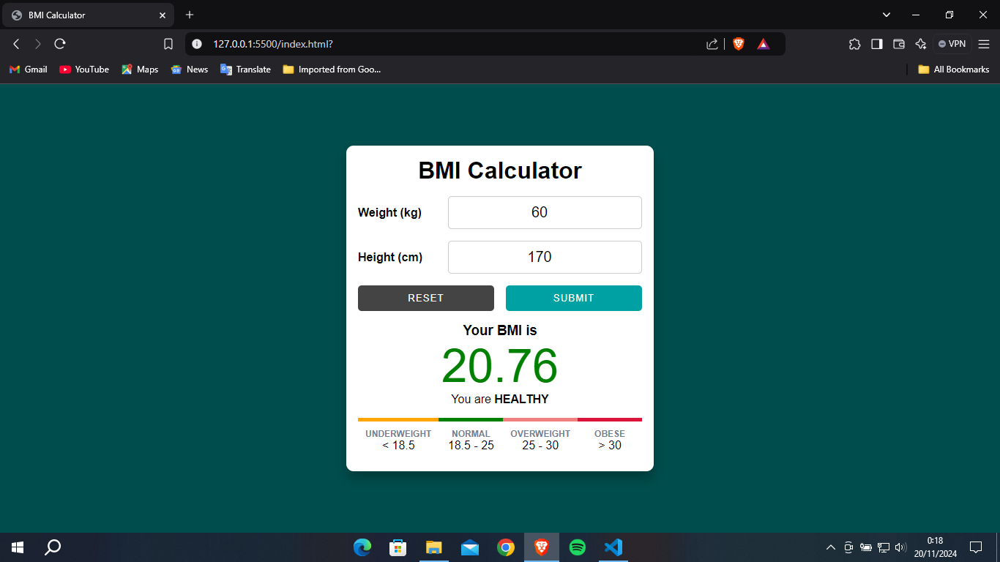

# BMI Calculator

<b>Create BMI Calculator with HTML, CSS, & JavaScript</b>
 

### Description
BMI is a measurement indicator used to determine the ideal weight category or not. BMI was developed by Adolphe Quetelet during the 19th century. Through the BMI calculation results, you will know your weight category, namely thin, ideal, excessive, or even obese.

## Preview

## References

<b>Youtube :</b>
<a href="https://youtu.be/oAVkXa76lzw?si=LQ4tNoU5tCqrKPZ4"><b>Click Me</b></a>

